<div align="center">

# ABYSS

### Descend into the dark. Make every turn count.

**An endless, turn-based dungeon crawler drawn entirely in ASCII.**

Choose a hero, brave forgotten chambers, and turn whatever you find into a reason to survive one more floor.

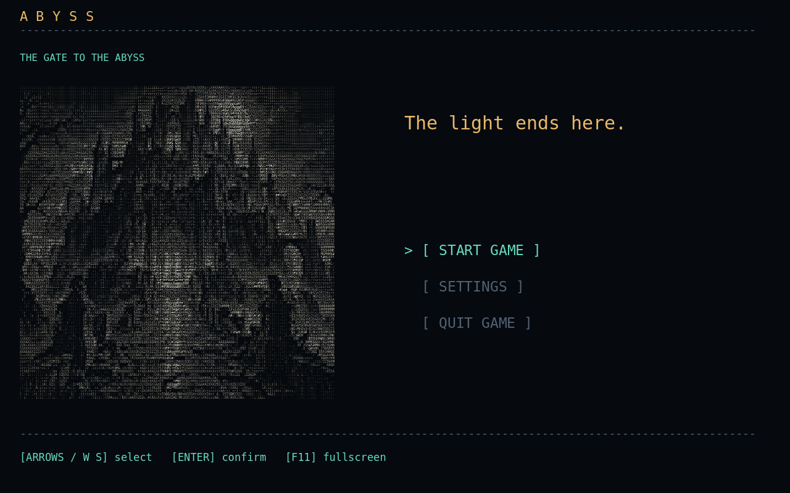

**Single-player · Procedural dungeons · Tactical combat · Dark fantasy**<br>
**English & Brazilian Portuguese**

[The adventure](#the-adventure) · [Choose your hero](#choose-your-hero) · [Explore the depths](#explore-the-depths) · [Play](#play-abyss) · [Controls](#controls)

</div>

## The adventure

Beneath the ruins, every stairway leads farther from daylight. Your torch will burn out. Your supplies will run low. The next chamber might hold a treasure, a traveler, or something that has been waiting for you.

**Abyss is about reaching the deepest floor you can before your expedition ends.** There is no final floor: the dungeon keeps unfolding, enemies grow stronger across successive cycles, and a Warden guards every fifth floor.

The world moves when you act. Read the room, choose your target, and decide whether the next turn should be spent attacking, healing, retreating, or preparing the ground beneath your enemy.

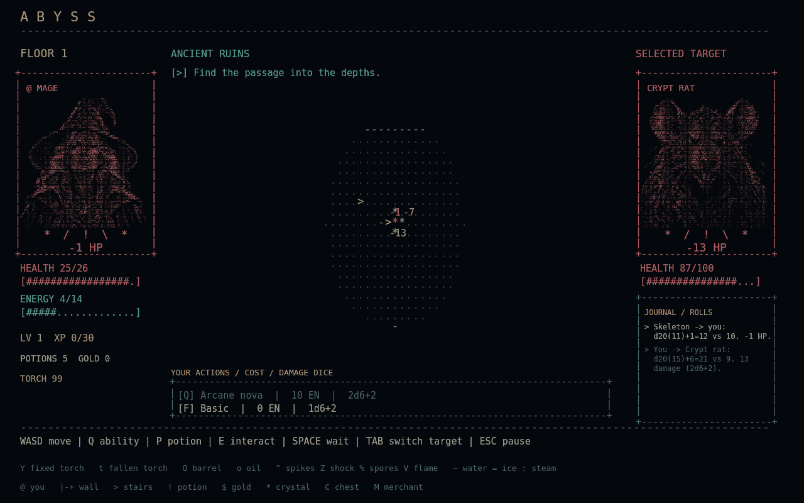

*An arcane nova, captured directly from the game. Portraits, projectiles, scenery, and effects are rendered with characters.*

## What awaits below

- **A different descent every time.** Procedural rooms and corridors, changing biomes, rare floor conditions, and occasional elite enemies.
- **Four heroes, eight advanced paths.** Begin as a Warrior, Mage, Archer, or Rogue. At level ten, choose a specialization that changes your portraits and abilities.
- **Tabletop-inspired combat.** D20 attack rolls, weapon damage dice, meaningful attributes, and healing rolls make preparation matter.
- **A reactive dungeon.** Ignite spilled oil, freeze water, extinguish flames, and use the terrain to change a fight.
- **Equipment worth building around.** Four rarity tiers and twenty-three named items with effects that interact with combat, light, hazards, and rewards.
- **Brief moments of safety.** Trade at a merchant's refuge or find the Lost Blacksmith behind the protection of his workshop.
- **A bestiary that remembers.** Unlock portraits and lore by defeating creatures, and keep those discoveries between expeditions.
- **An ASCII world in motion.** Detailed character portraits, animated attacks, flickering light, soft screen transitions, short 8-bit effects, and a restrained, dark soundtrack.

## Choose your hero

Each class has a different way to survive the first floors. Your starting weapon defines your basic attack; energy fuels the abilities that can turn a dangerous encounter around.

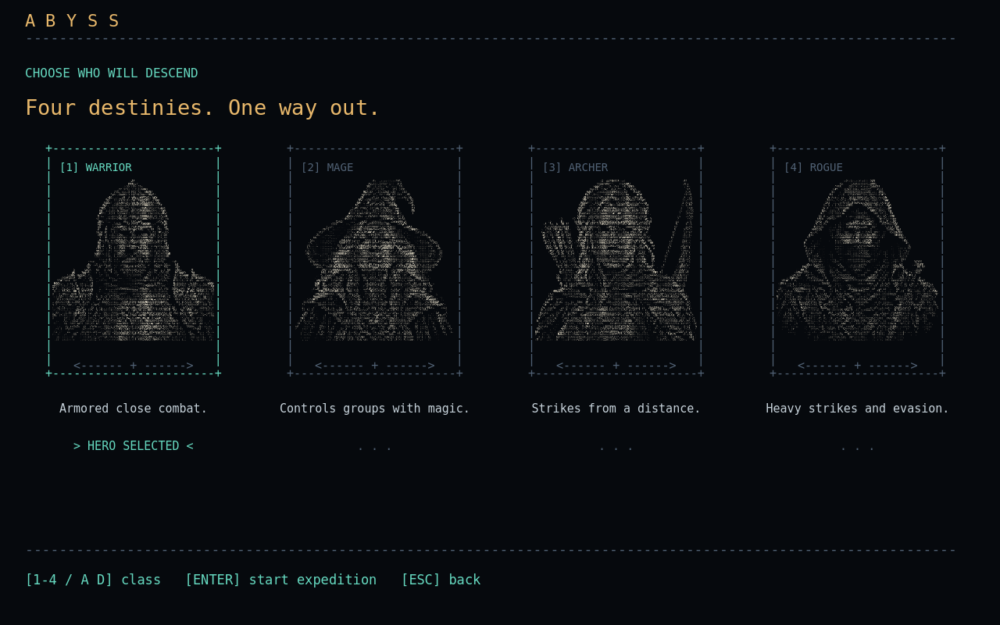

| Hero | Your approach | Advanced paths at level 10 |
| --- | --- | --- |
| **Warrior** | Fight up close and catch nearby enemies in a whirlwind. | **Sentinel** for a defensive bastion, or **Berserker** for a crushing strike. |
| **Mage** | Use a staff for free ranged basic attacks and release an arcane nova. | **Pyromancer** to wield fire, or **Cryomancer** to control the fight with ice. |
| **Archer** | Keep your distance, use the bow's reach, and commit energy to stronger shots. | **Ranger** for arrow volleys, or **Deadeye** for a powerful precision shot. |
| **Rogue** | Strike an adjacent enemy and slip behind them when the space is clear. | **Assassin** for a venomous blade, or **Shadowblade** to blind nearby foes. |

### A new path, not just a new title

Advancing improves your original ability and unlocks a second one. Each specialization also has its own normal and critical-health ASCII portraits. A Pyromancer's staff and nova become fiery attacks; a Cryomancer's become ice attacks that interact with enemies and the dungeon floor.

The choice lasts for the expedition. You can inspect both paths and decide later from your character sheet.

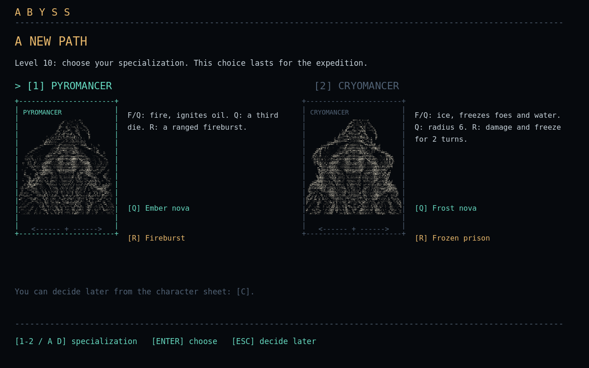

## Explore the depths

Every cycle of five floors brings another step into the dungeon's changing landscape. Layouts are procedural, environmental features are scattered rather than guaranteed, and each biome has **four regular enemy species and its own Warden**.

| Ancient Ruins | Forgotten Cisterns |
| --- | --- |
| 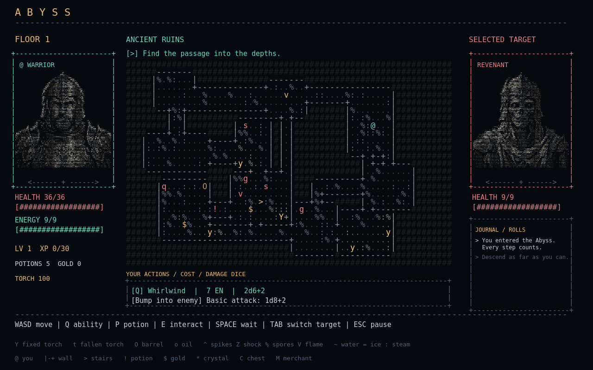 | 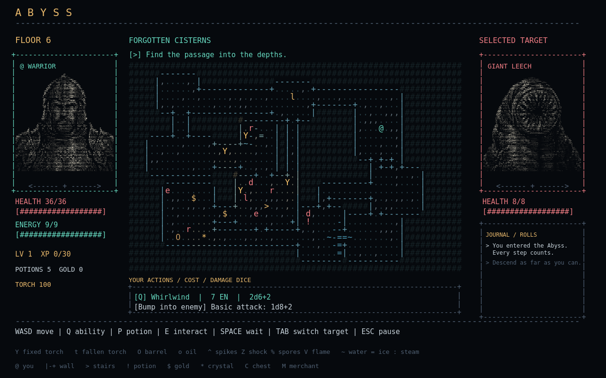 |
| Skeleton archers, goblins, revenants, and stone gargoyles inhabit broken halls. Watch for spikes underfoot. | Drowned figures, rats, leeches, and eels haunt the waterways. Discharge traps make wet ground dangerous. |

| Fungal Caves | Ember Forges |
| --- | --- |
| 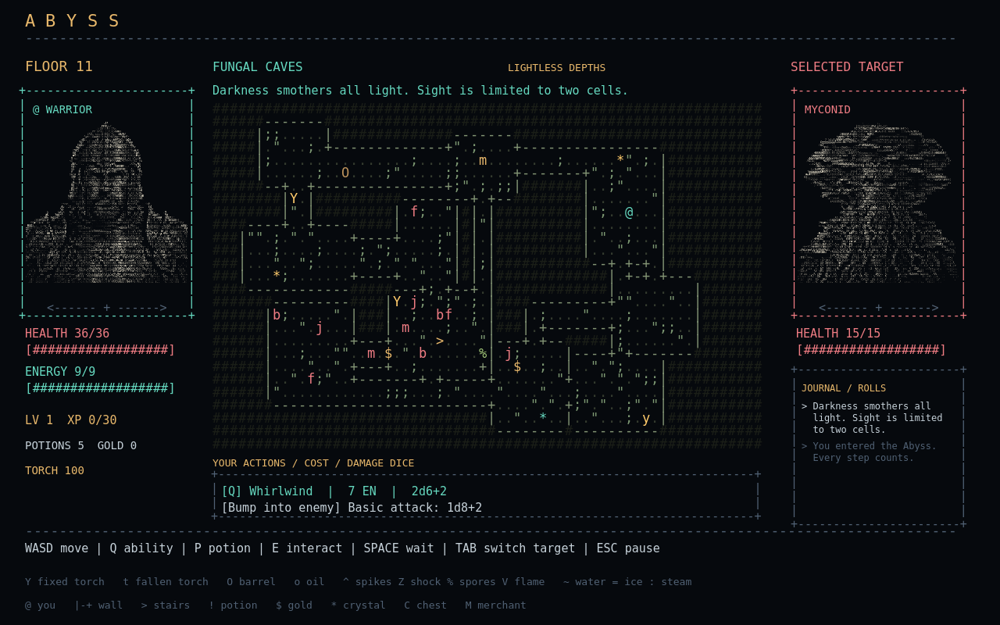 | 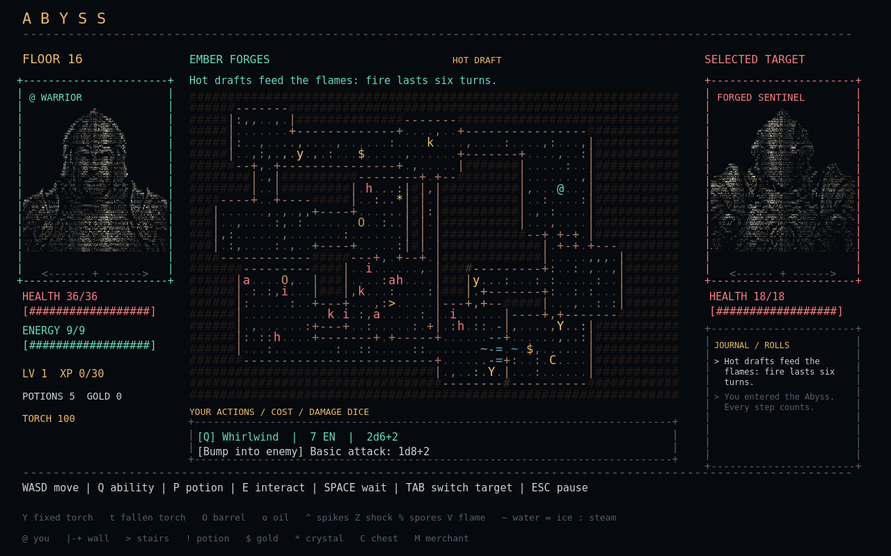 |
| Sporelings, crawlers, myconids, and spore blooms share a living underground forest. Some attacks carry poison. | Cinder hounds, ember imps, forged sentinels, and salamanders patrol the old workshops. Flames are part of the battlefield. |

*Map overviews above reveal exploration fog to show the layouts. During an expedition, your visibility depends on light and line of sight.*

Occasionally, the dungeon changes the terms of your expedition: an infestation gathers a single enemy species, deep darkness chokes the light, hot drafts sustain flames, or thin air makes energy recovery harder. Rare elites add another reason to inspect a room before committing.

## Fight with intent

A good turn is more than a high damage roll. Break line of sight against a skeleton archer. Avoid standing on water near an eel. Finish a leech before it feeds again. Save enough energy for the encounter you have not seen yet.

Basic bow and staff attacks cost no energy. Abilities do, and their cost and strength develop as your hero levels. Health potions roll their healing instead of restoring a fixed amount.

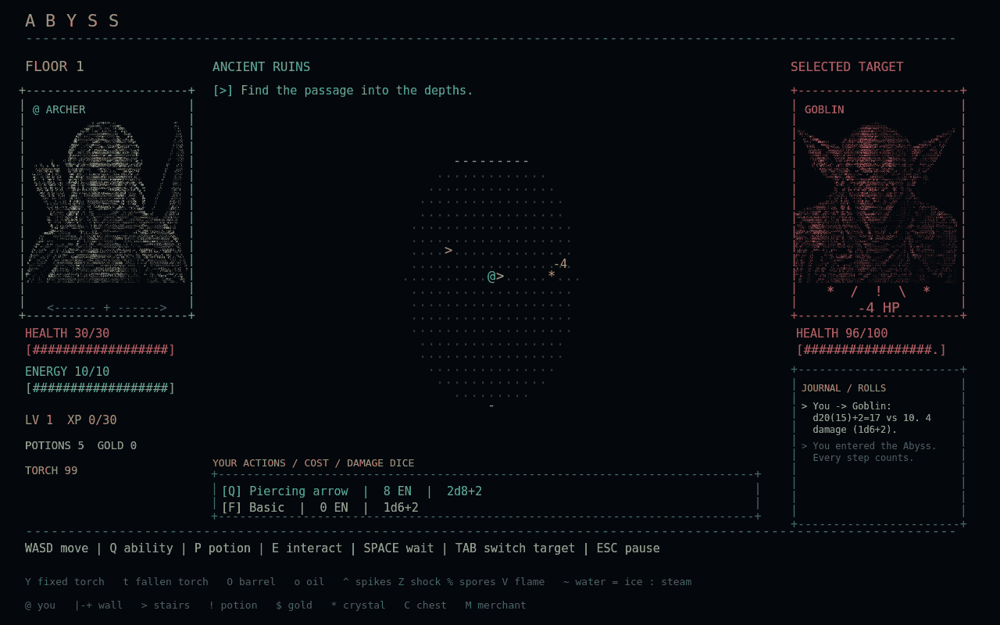

*Ranged attacks travel visibly along their firing direction. Enemies with ranged attacks need line of sight and pause between shots.*

### The floor is part of your arsenal

- **Oil + fire:** spill a barrel, then ignite it to leave dangerous ground behind.
- **Water + ice:** freeze a puddle; traps underneath wait for the thaw.
- **Fire + water:** create vapor that can blind creatures caught in it.
- **Cold + flames:** extinguish burning ground.
- **Fire + frozen enemies:** break the freeze with a thermal shock.

These interactions can help you escape or finish a fight, but the fire you create can also hurt you. Active conditions appear beneath portraits so you can see who is poisoned, frozen, blinded, burning, or protected.

### Face the Wardens

Every fifth floor has a guardian tied to its biome. Wardens awaken when you step into their stair chamber or damage them. Once awakened, they can pursue you beyond the room, moving up to two tiles per turn. The stairs remain sealed until the Warden is defeated. Their abilities mark the ground before they strike: notice the warning and use your turns to move.

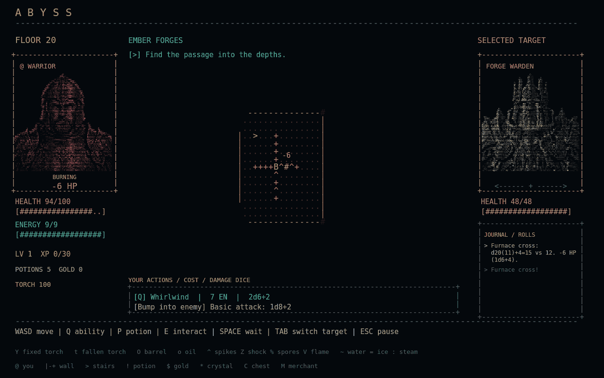

*The Forge Warden's furnace cross, shown in an in-engine combat preview.*

## Find a build in the darkness

Equip a **weapon**, **armor**, and an **accessory**. Common, Rare, Epic, and Legendary equipment offer stronger stats and distinctive effects, while weapon types and level requirements shape what you can use.

The twenty-three named items invite different approaches to the same room:

| Find | Change your approach |
| --- | --- |
| **Staff of Fluid Control** | Extinguish flames with basic shots and leave temporary water behind. |
| **Conductive Crossbow** | Strike a target on water to trigger a discharge around the impact. |
| **Fungal Sovereign Crown** | Turn spore traps into healing and become immune to poison. |
| **Continuous Flame Buckle** | Recover energy when a spent torch is automatically replaced by a spare. |
| **Hood of Shadow Legends** | Survive a lethal hit in darkness once, at the cost of the hood and all your energy. |

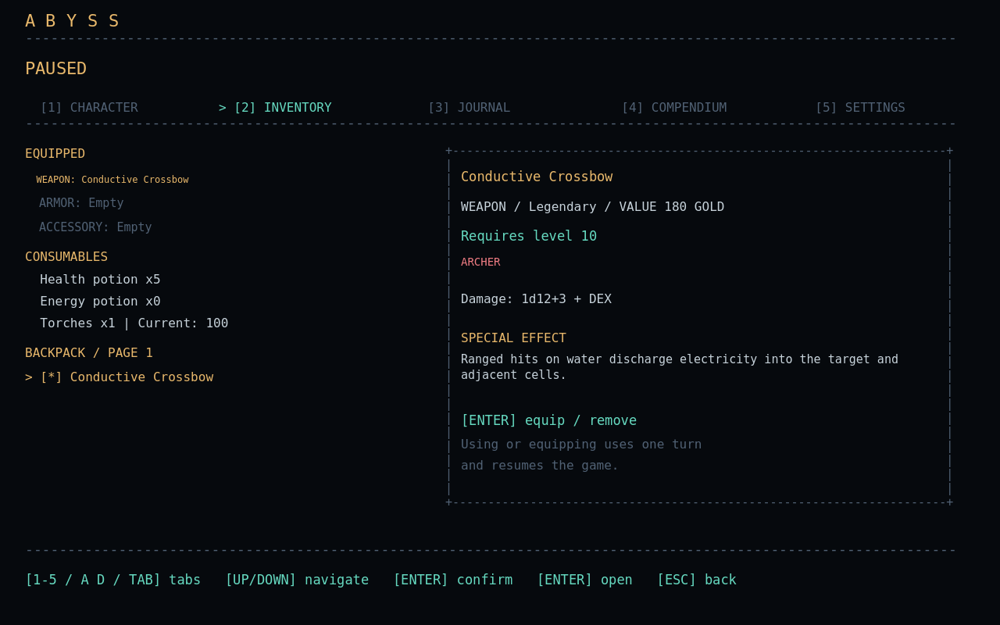

Torches and potions share your inventory with the equipment you collect. A fresh ordinary torch lasts one hundred turns; carried reserves take over automatically when it burns out. Without one, your personal field of view becomes much smaller.

## Meet the travelers who stayed

The **Merchant** offers a safe pause in the descent, with five items in stock and a place to sell unwanted finds. Purchases and sales ask for confirmation before your gold or equipment changes hands.

The **Lost Blacksmith** is harder to find. His protected workshop lets you improve ordinary equipment into higher rarities for an increasing gold cost. Named relics keep their own identity and cannot be reforged.

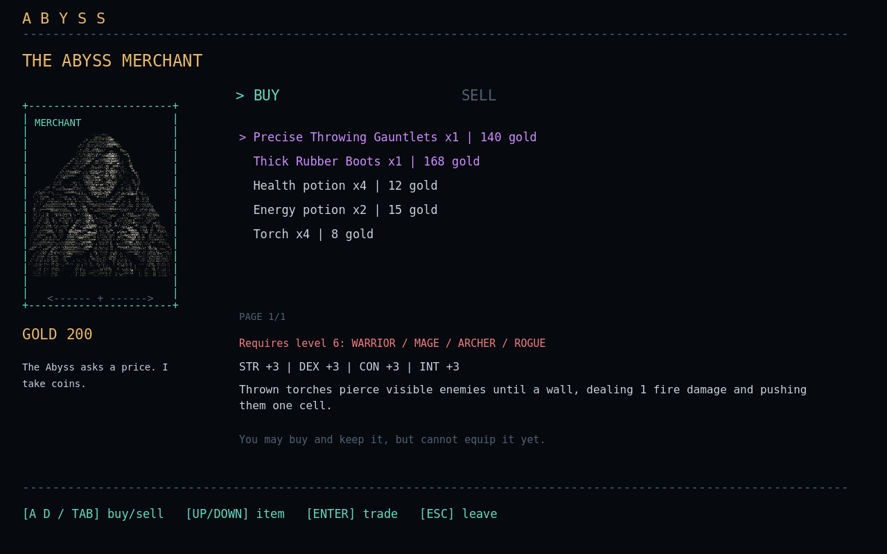

## Keep a record of what lives here

The pause menu opens your character sheet, inventory, journal, compendium, and settings. Review your attributes, inspect equipment effects, or look back through the diary and dice rolls before taking another step.

The bestiary begins with unknown entries. Defeat a creature to reveal its ASCII portrait, lore, and your cumulative number of kills. Its **twenty entries** are organized by biome, and discoveries remain available in future expeditions.

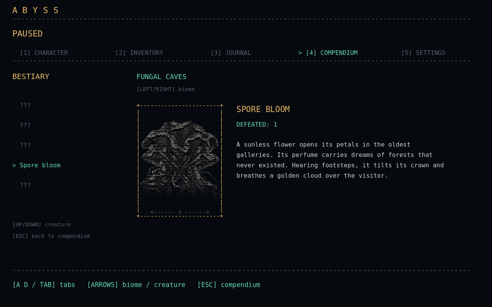

## A world made of characters

Abyss draws its world, interfaces, portraits, and effects using text glyphs. Detailed illustrations are converted into ASCII portraits, and characters shift into worn, exhausted versions as health becomes critical.

Short 8-bit sounds punctuate steps, attacks, and discoveries. Minimalist ambient loops accompany the menu, biomes, refuges, and Warden encounters. Music and effects have independent volume controls.

Settings are available from the main menu and pause screen, with separate **Language**, **Sound**, and **Video** menus. Choose English or Brazilian Portuguese, adjust sound levels, switch fullscreen, and select a resolution.

## Play Abyss

This repository contains the **Godot project and source code**. To play from source, use:

- **Godot .NET 4.7.2** — the edition with C# support.
- **.NET SDK 10**.
- A desktop environment compatible with Godot's OpenGL Compatibility renderer.

### From the editor

1. Import [project.godot](project.godot) into the Godot .NET editor.
2. Build the C# project.
3. Run the project and start a new expedition.

### From a Linux terminal

Run from the project directory, replacing the path with your Godot .NET executable:

```bash
GODOT_BIN="/absolute/path/to/godot-dotnet" ./play.sh
```

The launcher builds the project, imports its resources, and starts the game. See the [technical guide](docs/TECHNICAL.md) for manual build commands, project structure, diagnostics, and automated tests.

### Before you descend

**Expeditions are not saved.** Death ends the run, and returning to the main menu abandons your current progress after confirmation. Bestiary discoveries and your preferences persist between sessions.

## Controls

| Action | Keyboard |
| --- | --- |
| Move / melee attack with a compatible weapon | **WASD / Arrow keys**; hold to keep moving |
| Basic ranged attack with a bow or staff | **F**, then choose a direction |
| Class ability | **Q** |
| Advanced-class second ability | **R** |
| Select another target | **Tab** during play |
| Drink a health potion | **P** |
| Interact with stairs, Merchant, or Lost Blacksmith | **E** |
| Wait | **Space** |
| Open inventory | **I** |
| Pause / back | **Esc** |
| Switch pause tabs | **A/D**, **Left/Right**, **Tab**, or **1–5**; inside settings submenus, horizontal keys adjust values |
| Adjust sound or video | Open the relevant Settings submenu, then **A/D / Left/Right** |
| Toggle fullscreen | **F11** |

Throwing a torch is available from the inventory. Follow the on-screen prompts for equipment, trading, and confirmation screens.

## About this project

Built with **Godot .NET and C#**, Abyss combines a procedural dungeon simulation with a custom ASCII presentation. Source illustrations were generated with image tools and converted into character grids; sound assets are synthesized for the game.

All screenshots and GIFs in this page were captured from the Godot viewport using deterministic preview scenarios. GIFs show actual game animation, not concept art. Preview encounters are staged to make individual features visible.

- [Technical guide](docs/TECHNICAL.md)
- [Art sources and generation notes](ArtSources/README.md)
- [Media capture notes](docs/media/README.md)

---

<div align="center">

**Choose your path. Keep the torch burning. See how far you can go.**

</div>
